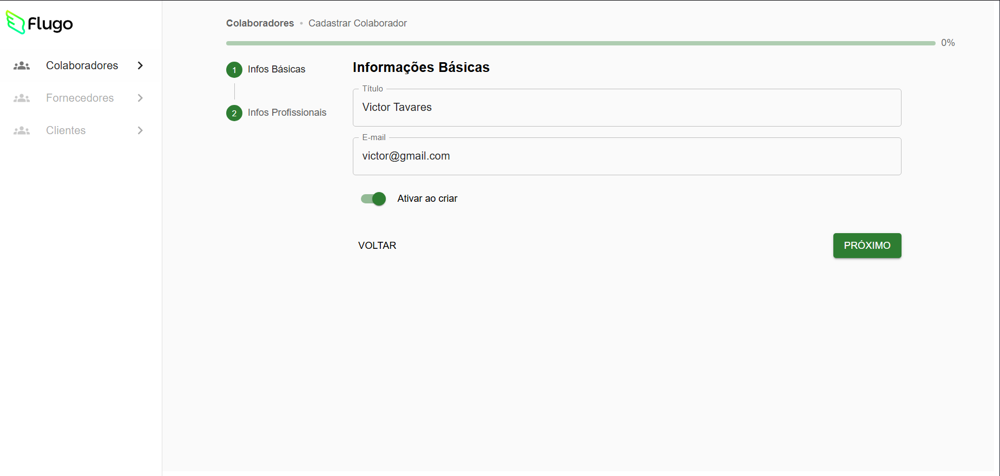
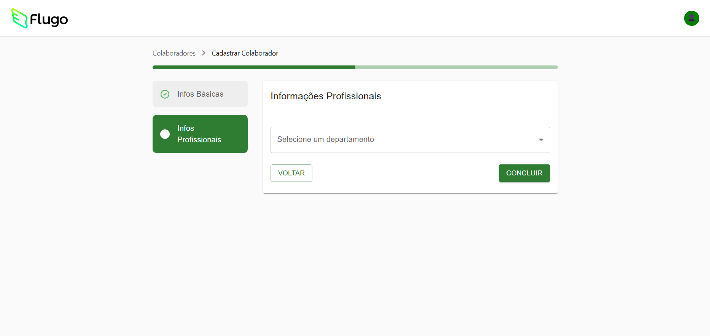
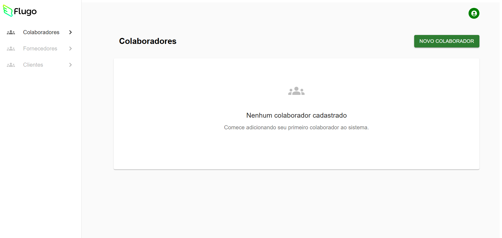
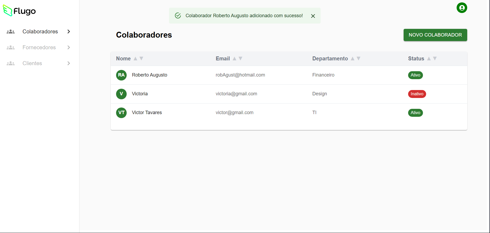

# 📋 Multi Step Form - Cadastro de Colaboradores

Formulário multi-etapas para cadastro e gerenciamento de colaboradores, desenvolvido com **React**, **TypeScript** e **Vite**, integrado ao **Firebase**.

🔗 **Acesse online:** [multi-step-form-app-for-flugo.vercel.app](https://multi-step-form-app-for-flugo.vercel.app)  

---

## 🚀 Tecnologias

| Categoria       | Tecnologias |
|-----------------|-------------|
| Front-end       | React, TypeScript, Vite |
| UI & Estilo     | Material UI |
| Backend         | Firebase (Firestore) |
---

## 📌 Funcionalidades

| Funcionalidade | Descrição |
|----------------|-----------|
| Cadastro Multi-etapas | Formulário dividido em etapas com validação |
| Responsividade | Layout adaptado para desktop e mobile |
| Integração com Firestore | Armazenamento e gestão de dados na nuvem |

---

## 🛠 Instalação

```bash
# 1. Clone o repositório
git clone https://github.com/VictorTavaresRafael/multi-step-form-app-for-flugo

# 2. Acesse a pasta do projeto
cd multi-step-form-app-for-flugo

# 3. Instale as dependências
npm install

# 4. Configure as variáveis de ambiente (.env) com as credenciais do Firebase

# 5. Inicie o servidor de desenvolvimento
npm run dev

```

Configurar variáveis de ambiente com credenciais do Firebase antes de iniciar.

O projeto ficará disponível em: http://localhost:8080

---
### Principais Códigos

- Componente de formulário multi-etapas:

Veja a estrutura do formulário aqui: [código do formulário](./src/components/EmployeeForm.tsx)  

- Integração com Firebase:

```ts
// src/firebase/collaboratorService.ts
import { db } from "./config";
import { collection, addDoc, getDocs, deleteDoc, updateDoc, doc, serverTimestamp } from "firebase/firestore";
import type { Collaborator } from "../types/collaborator";

const collaboratorsCollection = collection(db, "collaborators");

// GET all collaborators
export const getCollaborators = async (): Promise<Collaborator[]> => {
  const querySnapshot = await getDocs(collaboratorsCollection);
  return querySnapshot.docs.map(doc => ({
      id: doc.id,
      ...doc.data()
  } as Collaborator));
};

// ADD a new collaborator
export const addCollaborator = async (collaboratorData: Omit<Collaborator, 'id' | 'createdAt'>) => {
    const docWithTimestamp = {
      ...collaboratorData,
      createdAt: serverTimestamp() // Adiciona o timestamp do servidor
    };
    const docRef = await addDoc(collaboratorsCollection, docWithTimestamp);
    return docRef.id;
};

// DELETE a collaborator
export const deleteCollaborator = async (id: string): Promise<void> => {
  const collaboratorDoc = doc(db, "collaborators", id);
  await deleteDoc(collaboratorDoc);
};

// UPDATE a collaborator
export const updateCollaborator = async (id: string, updates: Partial<Collaborator>): Promise<void> => {
  const collaboratorDoc = doc(db, "collaborators", id);
  await updateDoc(collaboratorDoc, updates);
};
```

### Configuração do Firebase

```ts
// src/firebase/config.ts
import { initializeApp } from "firebase/app";
import { getFirestore } from "firebase/firestore";

const firebaseConfig = {
  apiKey: import.meta.env.VITE_FIREBASE_API_KEY,
  authDomain: import.meta.env.VITE_FIREBASE_AUTH_DOMAIN,
  projectId: import.meta.env.VITE_FIREBASE_PROJECT_ID,
  storageBucket: import.meta.env.VITE_FIREBASE_STORAGE_BUCKET,
  messagingSenderId: import.meta.env.VITE_FIREBASE_MESSAGING_SENDER_ID,
  appId: import.meta.env.VITE_FIREBASE_APP_ID,
};

const app = initializeApp(firebaseConfig);
export const db = getFirestore(app);
```

---


## 🖼 Screenshots

### Formulário - Etapa 1



### Formulário - Etapa 2


### Lista de Colaboradores (vazia)



### Lista de Colaboradores (preenchida)



---

## Estrutura do Projeto
 - src/components: Componentes reutilizáveis (formulário, lista, header, etc.)
 - src/pages: Páginas principais (Index, NotFound) 
 - src/hooks: Hooks customizados 
 - src/firebase: Integração com Firebase 
 - src/types: Tipos TypeScript 