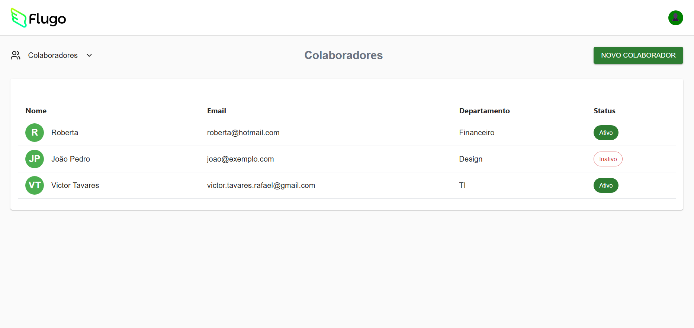
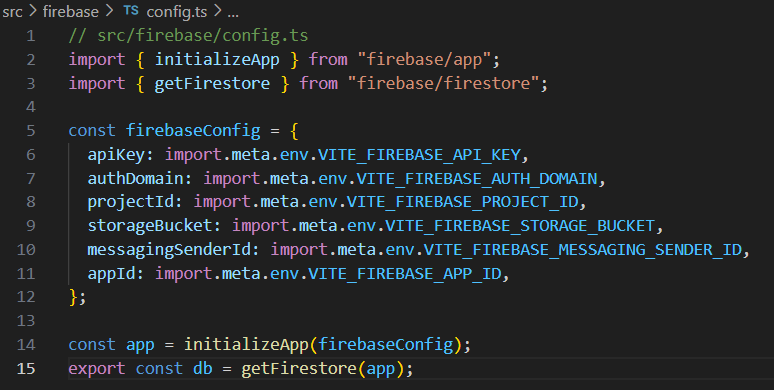

# Multi Step Form - Cadastro de Colaboradores

## Sobre o Projeto

O **Multi Step Form** é uma aplicação web desenvolvida com React, TypeScript e Vite, focada no cadastro e gestão de colaboradores. O projeto utiliza Material UI, Tailwind CSS e Firebase para uma interface moderna, responsiva e integração com backend.

## Como rodar localmente

**Pré-requisitos:**
- Node.js e npm instalados

**Passos:**
```sh
# Clone o repositório
git clone https://github.com/VictorTavaresRafael/multi-step-form

# Acesse a pasta do projeto
cd multi-step-form

# Instale as dependências
npm install

# Inicie o servidor de desenvolvimento
npm run dev
```

Acesse `http://localhost:5173` no navegador para visualizar a aplicação.

---

## Evidências do Projeto

### Telas da Aplicação




### Principais Códigos

- Componente de formulário multi-etapas:

```tsx
import React, { useState } from 'react';
import { Button, Card, CardContent, CardHeader, TextField, FormControl, InputLabel, Select, MenuItem, Switch, LinearProgress, Typography, Box } from '@mui/material';
import { CheckCircle2, ChevronRight } from 'lucide-react';
import type { EmployeeFormData, FormStep } from '@/types/employee';
import { useToast } from '@/hooks/use-toast';

interface EmployeeFormProps {
  onSubmit: (data: EmployeeFormData) => void;
  onCancel: () => void;
}

const departments = [
  'Design',
  'TI',
  'Marketing',
  'Produto',
  'Vendas',
  'RH',
  'Financeiro'
];

export function EmployeeForm({ onSubmit, onCancel }: EmployeeFormProps) {
  const [currentStep, setCurrentStep] = useState<FormStep>('basic');
  const [formData, setFormData] = useState<EmployeeFormData>({
    name: '',
    email: '',
    department: '',
    activeOnCreate: true
  });
  const [errors, setErrors] = useState<Partial<EmployeeFormData>>({});
  const { toast } = useToast();

  const validateBasicInfo = (): boolean => {
    const newErrors: Partial<EmployeeFormData> = {};
    
    if (!formData.name.trim()) {
      newErrors.name = 'Nome é obrigatório';
    }
    
    if (!formData.email.trim()) {
      newErrors.email = 'E-mail é obrigatório';
    } else if (!/^[^\s@]+@[^\s@]+\.[^\s@]+$/.test(formData.email)) {
      newErrors.email = 'E-mail inválido';
    }

    setErrors(newErrors);
    return Object.keys(newErrors).length === 0;
  };

  const validateProfessionalInfo = (): boolean => {
    const newErrors: Partial<EmployeeFormData> = {};
    
    if (!formData.department) {
      newErrors.department = 'Departamento é obrigatório';
    }

    setErrors(newErrors);
    return Object.keys(newErrors).length === 0;
  };

  const handleNext = () => {
    if (validateBasicInfo()) {
      setCurrentStep('professional');
      toast({
        title: "Etapa concluída",
        description: "Informações básicas salvas com sucesso!",
      });
    }
  };

  const handleBack = () => {
    setCurrentStep('basic');
  };

  const handleSubmit = (e: React.FormEvent) => {
    e.preventDefault();
    if (validateProfessionalInfo()) {
      onSubmit(formData);
    }
  };

  const updateFormData = (field: keyof EmployeeFormData, value: any) => {
    setFormData(prev => ({ ...prev, [field]: value }));
    if (errors[field]) {
      setErrors(prev => ({ ...prev, [field]: undefined }));
    }
  };

  const progress = currentStep === 'basic' ? 0 : 50;

  return (
  <Box maxWidth="md" mx="auto" p={3}>
      {/* Breadcrumb */}
      <Box mb={3}>
        <Box display="flex" alignItems="center" color="text.secondary" fontSize={14} mb={2}>
          <span>Colaboradores</span>
          <ChevronRight style={{ width: 18, height: 18, margin: '0 8px' }} />
          <span style={{ color: '#222' }}>Cadastrar Colaborador</span>
        </Box>
        <LinearProgress variant="determinate" value={progress} color="success" sx={{ mb: 2, height: 8, borderRadius: 4 }} />
      </Box>

      {/* Steps Sidebar */}
      <Box display="flex" gap={4}>
        <Box width={200}>
          <Box mb={2}>
            <Box display="flex" alignItems="center" gap={2} p={2} borderRadius={2} bgcolor={currentStep === 'basic' ? 'success.main' : 'grey.200'} color={currentStep === 'basic' ? 'success.contrastText' : 'text.secondary'}>
              {currentStep === 'professional' ? (
                <CheckCircle2 style={{ width: 20, height: 20, color: '#4caf50' }} />
              ) : (
                <Box width={20} height={20} borderRadius="50%" bgcolor="currentColor" display="flex" alignItems="center" justifyContent="center" fontWeight={500} fontSize={14}>1</Box>
              )}
              <Typography fontWeight={500}>Infos Básicas</Typography>
            </Box>
          </Box>
          <Box>
            <Box display="flex" alignItems="center" gap={2} p={2} borderRadius={2} bgcolor={currentStep === 'professional' ? 'success.main' : 'grey.200'} color={currentStep === 'professional' ? 'success.contrastText' : 'text.secondary'}>
              <Box width={20} height={20} borderRadius="50%" bgcolor="currentColor" display="flex" alignItems="center" justifyContent="center" fontWeight={500} fontSize={14}>2</Box>
              <Typography fontWeight={500}>Infos Profissionais</Typography>
            </Box>
          </Box>
        </Box>

        {/* Form Content */}
        <Box flex={1}>
          <Card>
            <CardHeader
              title={
                <Typography variant="h6">
                  {currentStep === 'basic' ? 'Informações Básicas' : 'Informações Profissionais'}
                </Typography>
              }
            />
            <CardContent>
              <form onSubmit={handleSubmit}>
                {currentStep === 'basic' ? (
                  <>
                    <FormControl fullWidth margin="normal">
                      <InputLabel htmlFor="name"></InputLabel>
                      <TextField
                        id="name"
                        value={formData.name}
                        onChange={(e) => updateFormData('name', e.target.value)}
                        placeholder="João da Silva"
                        error={!!errors.name}
                        helperText={errors.name}
                        variant="outlined"
                        label="Nome"
                      />
                    </FormControl>
                    <FormControl fullWidth margin="normal">
                      <InputLabel htmlFor="email"></InputLabel>
                      <TextField
                        id="email"
                        type="email"
                        value={formData.email}
                        onChange={(e) => updateFormData('email', e.target.value)}
                        placeholder="joao.silva@exemplo.com"
                        error={!!errors.email}
                        helperText={errors.email}
                        variant="outlined"
                        label="E-mail"
                      />
                    </FormControl>
                    <Box display="flex" alignItems="center" justifyContent="space-between" mt={2} mb={2}>
                      <Typography>Ativar ao criar</Typography>
                      <Switch
                        checked={formData.activeOnCreate}
                        onChange={(e) => updateFormData('activeOnCreate', e.target.checked)}
                        color="success"
                      />
                    </Box>
                    <Box display="flex" justifyContent="space-between" pt={2}>
                      <Button variant="outlined" onClick={onCancel} type="button" color="success">
                        Voltar
                      </Button>
                      <Button variant="contained" onClick={handleNext} type="button" color="success">
                        Próximo
                      </Button>
                    </Box>
                  </>
                ) : (
                  <>
                    <FormControl fullWidth margin="normal">
                      <InputLabel id="department-label">Selecione um departamento</InputLabel>
                      <Select
                        labelId="department-label"
                        id="department"
                        value={formData.department}
                        label="Selecione um departamento"
                        onChange={(e) => updateFormData('department', e.target.value)}
                        error={!!errors.department}
                      >
                        {departments.map((dept) => (
                          <MenuItem key={dept} value={dept}>{dept}</MenuItem>
                        ))}
                      </Select>
                      {errors.department && (
                        <Typography color="error" variant="body2">{errors.department}</Typography>
                      )}
                    </FormControl>
                    <Box display="flex" justifyContent="space-between" pt={2}>
                      <Button variant="outlined" onClick={handleBack} type="button" color="success">
                        Voltar
                      </Button>
                      <Button variant="contained" type="submit" color="success">
                        Concluir
                      </Button>
                    </Box>
                  </>
                )}
              </form>
            </CardContent>
          </Card>
        </Box>
        </Box>
    </Box>
  );
}
```

- Integração com Firebase:

```ts
// src/firebase/collaboratorService.ts
import { db } from "./config";
import { collection, addDoc, getDocs, deleteDoc, updateDoc, doc, serverTimestamp } from "firebase/firestore";
import type { Collaborator } from "../types/collaborator";

const collaboratorsCollection = collection(db, "collaborators");

// GET all collaborators
export const getCollaborators = async (): Promise<Collaborator[]> => {
  const querySnapshot = await getDocs(collaboratorsCollection);
  return querySnapshot.docs.map(doc => ({
      id: doc.id,
      ...doc.data()
  } as Collaborator));
};

// ADD a new collaborator
export const addCollaborator = async (collaboratorData: Omit<Collaborator, 'id' | 'createdAt'>) => {
    const docWithTimestamp = {
      ...collaboratorData,
      createdAt: serverTimestamp() // Adiciona o timestamp do servidor
    };
    const docRef = await addDoc(collaboratorsCollection, docWithTimestamp);
    return docRef.id;
};

// DELETE a collaborator
export const deleteCollaborator = async (id: string): Promise<void> => {
  const collaboratorDoc = doc(db, "collaborators", id);
  await deleteDoc(collaboratorDoc);
};

// UPDATE a collaborator
export const updateCollaborator = async (id: string, updates: Partial<Collaborator>): Promise<void> => {
  const collaboratorDoc = doc(db, "collaborators", id);
  await updateDoc(collaboratorDoc, updates);
};
```

### Configuração do Firebase



---

## Estrutura do Projeto

- `src/components`: Componentes reutilizáveis (formulário, lista, header)
- `src/pages`: Páginas principais (Index, NotFound)
- `src/hooks`: Hooks customizados
- `src/firebase`: Integração com Firebase
- `src/types`: Tipos TypeScript
- `src/lib`: Funções utilitárias
