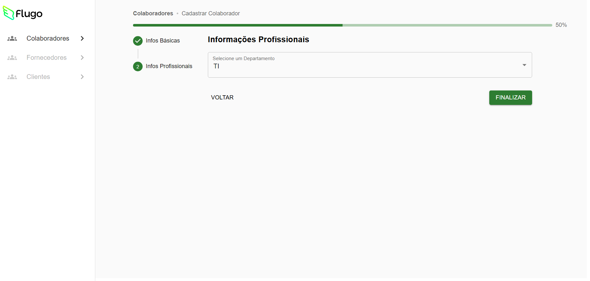

# Multi Step Form - Cadastro de Colaboradores

## Sobre o Projeto

O **Multi Step Form** é uma aplicação web desenvolvida com React, TypeScript e Vite, focada no cadastro e gestão de colaboradores. O projeto utiliza Material UI, Tailwind CSS e Firebase para uma interface moderna, responsiva e integração com backend.

## Como rodar localmente

**Pré-requisitos:**
- Node.js e npm instalados

**Passos:**
```sh
# Clone o repositório
git clone https://github.com/VictorTavaresRafael/multi-step-form

# Acesse a pasta do projeto
cd multi-step-form

# Instale as dependências
npm install

# Inicie o servidor de desenvolvimento
npm run dev
```

Acesse `http://localhost:5173` no navegador para visualizar a aplicação.

---

## Evidências do Projeto

### Telas da Aplicação





### Principais Códigos

- Componente de formulário multi-etapas:

Veja a estrutura do formulário aqui: [código do formulário](./src/components/EmployeeForm.tsx)  

- Integração com Firebase:

```ts
// src/firebase/collaboratorService.ts
import { db } from "./config";
import { collection, addDoc, getDocs, deleteDoc, updateDoc, doc, serverTimestamp } from "firebase/firestore";
import type { Collaborator } from "../types/collaborator";

const collaboratorsCollection = collection(db, "collaborators");

// GET all collaborators
export const getCollaborators = async (): Promise<Collaborator[]> => {
  const querySnapshot = await getDocs(collaboratorsCollection);
  return querySnapshot.docs.map(doc => ({
      id: doc.id,
      ...doc.data()
  } as Collaborator));
};

// ADD a new collaborator
export const addCollaborator = async (collaboratorData: Omit<Collaborator, 'id' | 'createdAt'>) => {
    const docWithTimestamp = {
      ...collaboratorData,
      createdAt: serverTimestamp() // Adiciona o timestamp do servidor
    };
    const docRef = await addDoc(collaboratorsCollection, docWithTimestamp);
    return docRef.id;
};

// DELETE a collaborator
export const deleteCollaborator = async (id: string): Promise<void> => {
  const collaboratorDoc = doc(db, "collaborators", id);
  await deleteDoc(collaboratorDoc);
};

// UPDATE a collaborator
export const updateCollaborator = async (id: string, updates: Partial<Collaborator>): Promise<void> => {
  const collaboratorDoc = doc(db, "collaborators", id);
  await updateDoc(collaboratorDoc, updates);
};
```

### Configuração do Firebase


---

## Estrutura do Projeto

- `src/components`: Componentes reutilizáveis (formulário, lista, header)
- `src/pages`: Páginas principais (Index, NotFound)
- `src/hooks`: Hooks customizados
- `src/firebase`: Integração com Firebase
- `src/types`: Tipos TypeScript
- `src/lib`: Funções utilitárias
